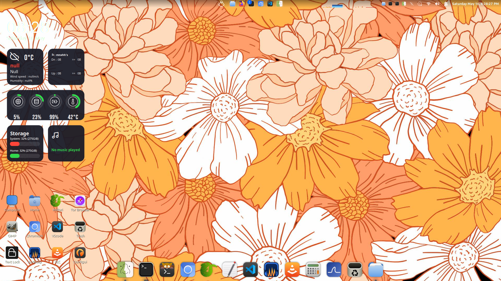

<div align="center">
  
  <h1>Finder for Linux</h1>
  <p>
    A macOS-style Finder launcher that wraps your existing file manager<br>
    with branded desktop actions and custom icons.
  </p>
  <p>
    <a href="https://github.com/shroomcoder/finder-linux/releases"></a>
    <a href="LICENSE"></a>
    <a href="https://github.com/shroomcoder/finder-linux/releases"></a>
  </p>
</div>

---

## Screenshots

<div align="center">
  
  <br>
  <sup>Finder on Linux Mint — <a href="screenshots/demo.png">view full size</a></sup>
</div>

<br>

<div align="center">
  <table>
    <tr>
      <td align="center" width="25%">
        <p><strong>KDE Plasma</strong></p>
        <p><sup><em>Will be uploaded soon</em></sup></p>
      </td>
      <td align="center" width="25%">
        <p><strong>GNOME</strong></p>
        <p><sup><em>Will be uploaded soon</em></sup></p>
      </td>
      <td align="center" width="25%">
        <p><strong>XFCE</strong></p>
        <p><sup><em>Will be uploaded soon</em></sup></p>
      </td>
      <td align="center" width="25%">
        <p><strong>Cinnamon</strong></p>
        <p><sup><em>Will be uploaded soon</em></sup></p>
      </td>
    </tr>
  </table>
</div>

---

## Features

- **Wrapper script** — detects your installed file manager at runtime (Nemo, Nautilus, Dolphin, Thunar, or fallback to xdg-open)
- **Desktop entry** — appears as "Finder" in your app menu with 8 right-click actions (Desktop, Documents, Downloads, Music, Pictures, Videos, Recents, New Window)
- **macOS-style icons** — 5 icon sizes from 32×32 to 512×512
- **Two install methods** — choose per-user or system-wide

---

## Installation

| Method | How |
|--------|-----|
| **Shell script** (no root) | `cd script/ && ./install.sh` |
| **.deb package** (system-wide) | Download `.deb` from [Releases](https://github.com/shroomcoder/finder-linux/releases) then `sudo dpkg -i finder-linux.deb && sudo apt install -f` |

### Quick comparison

| | Script install | .deb package |
|---|---|---|
| Root required | No | Yes |
| Detection | At install time | At runtime |
| Install location | `~/.local/share` | `/usr` |
| Uninstall | `./uninstall.sh` | `sudo dpkg -r finder-linux` |

---

## Supported File Managers

| Manager | Desktop | Wrapper detects |
|---------|---------|----------------|
| Nemo | Cinnamon | ✓ (1st priority) |
| Nautilus (GNOME Files) | GNOME | ✓ (2nd) |
| Dolphin | KDE Plasma | ✓ (3rd) |
| Thunar | XFCE | ✓ (4th) |
| xdg-open | Any | ✓ (fallback) |

> The wrapper checks for these in order. On first launch, it opens whichever one you have installed.

---

## From Source

If you want to rebuild the `.deb` yourself:

```bash
cd deb/
./build.sh
```

---

## License

MIT — see [LICENSE](LICENSE).
